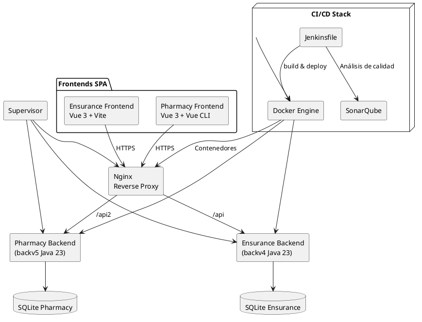
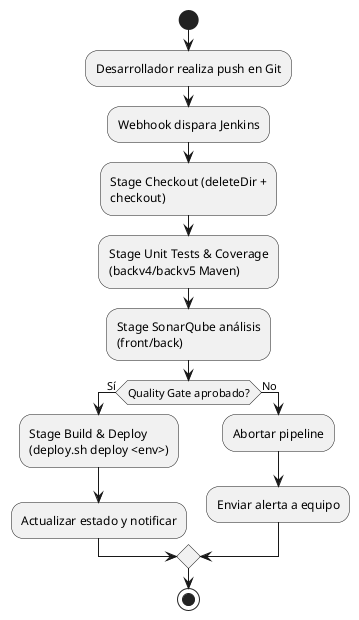
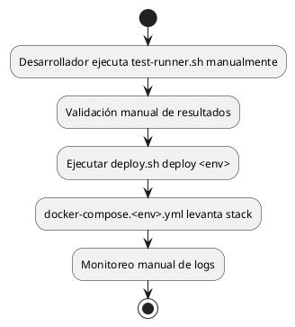
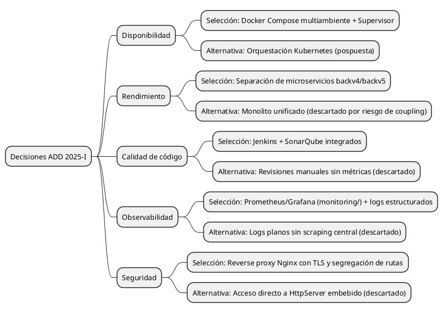
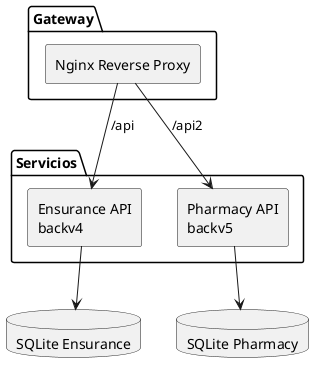
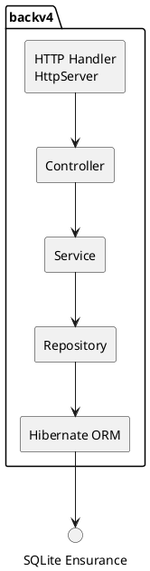
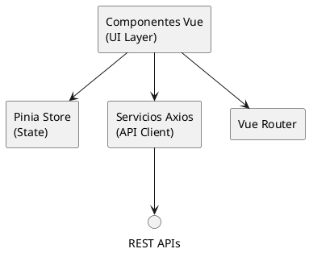
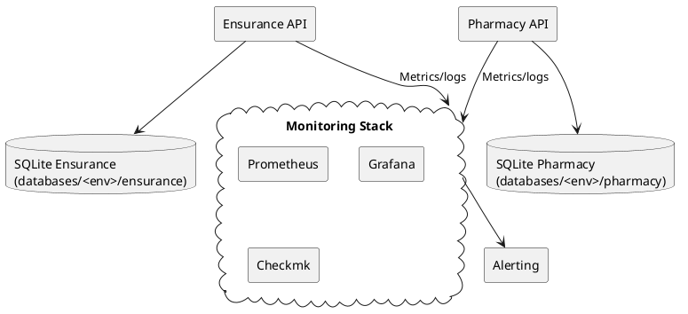

# Documentación de Arquitectura Integrada — Ensurance Pharmacy

## A. Visión general del sistema

### A.1 Contexto
- **Propósito**: Integrar la gestión de seguros médicos (`ensurance/`) y operaciones de farmacia (`pharmacy/`) mediante un sistema unificado que asegure trazabilidad y atención omnicanal.
- **Ámbitos funcionales**: Gestión de pólizas, reclamaciones y afiliados desde el frontend Ensurance; control de inventario, órdenes y dispensación en el frontend Pharmacy; APIs Java (`backv4/`, `backv5/`) como núcleo transaccional; orquestación de despliegues con `docker-compose.*` y `deploy.sh`.
- **Actores principales**: Afiliados y personal de farmacia (UI), agentes de seguros, equipo de operaciones y monitoreo (`monitoring/`), y el equipo DevOps que mantiene la entrega continua con `Jenkinsfile`.
- **Artefactos relevantes**: Imagen unificada descrita en `Dockerfile`, bases SQLite por ambiente (`databases/<env>/`), script de pruebas `test-runner.sh`, configuraciones de calidad `sonar-project.properties` y documentación previa en `documentation/DOCUMENTACION_COMPLETA.md`.

### A.2 Diagrama general del sistema
El diagrama siguiente resume la interacción entre frontends, backends, capa de orquestación y soporte de CI/CD.

## B. Pipeline de entrega continua

### B.1 Objetivos clave
- **Integración temprana**: Ejecutar pruebas y análisis en cada cambio mediante `Jenkinsfile` para prevenir regresiones en `backv4`, `backv5`, `ensurance/` y `pharmacy/`.
- **Calidad demostrable**: Consolidar cobertura (JaCoCo, LCOV) y métricas estáticas (`sonar-project.properties`) para soportar decisiones de arquitectura.
- **Despliegue repetible**: Automatizar `deploy.sh` sobre los archivos `docker-compose.<env>.yml`, garantizando consistencia entre DEV, QA y MAIN.
- **Retroalimentación continua**: Notificar resultados vía correo y logs (`deploy.sh status`) para mantener al equipo informado.

### B.2 Flujo actual
- **Disparo**: Push o PR en ramas observadas por Jenkins (ver `Jenkinsfile`).
- **Checkout**: Limpieza de workspace y clon (`deleteDir`, `checkout scm`).
- **Pruebas unitarias + cobertura**: Maven en `backv4/` y `backv5/`, generación de `target/site/jacoco/jacoco.xml`.
- **Análisis SonarQube**: Escaneos diferenciados por rama para frontends y backends.
- **Quality Gate**: `waitForQualityGate` bloquea el pipeline si falla.
- **Empaquetado y despliegue**: `deploy.sh deploy <env> --rebuild` construye imagen y levanta contenedores.
- **Notificación**: Envío de correo (`emailext`) y ejecución de `./deploy.sh status` para confirmar estado.

### B.3 Diagrama del pipeline actual

### B.4 Artefactos y responsabilidades
- **Pipeline as Code (`Jenkinsfile`)**: Define stages, matrices de proyectos Sonar y condiciones por rama.
- **Scripts de soporte (`deploy.sh`, `test-runner.sh`)**: Encapsulan despliegue multiambiente y ejecución de pruebas locales.
- **Infraestructura de calidad (`docker-compose.cicd.yml`, `monitoring/`)**: Facilitan SonarQube, Jenkins y observabilidad para validar decisiones.
- **Convenciones (`README.md`, `DOCUMENTACION_COMPLETA.md`)**: Documentan comandos y estados deseados para desarrollo, QA y MAIN.

## C. Análisis ADD (Attribute-Driven Design)

### C.1 Stakeholders y alcance
- **Equipo de desarrollo**: Busca ciclos de entrega cortos y capacidad de iterar en `ensurance/` y `pharmacy/`.
- **Equipo de QA y cumplimiento**: Requiere evidencia de cobertura, trazabilidad y ambientes reproducibles.
- **Operaciones/DevOps**: Responsable de estabilidad y escalamiento de contenedores desplegados con `docker-compose.*`.
- **Usuarios finales (afiliados y personal de farmacia)**: Esperan tiempos de respuesta bajos y disponibilidad 24/7.

### C.2 Drivers de diseño
- **Requerimientos funcionales**: Integración de pólizas y dispensas; sincronización de catálogos; emisión de reportes regulators.
- **Atributos de calidad prioritarios**: Disponibilidad, rendimiento, seguridad, observabilidad, modifiabilidad y portabilidad entre ambientes.
- **Restricciones**: Uso de Java 23 y Vue 3 (definidos en los proyectos existentes), persistencia en SQLite para entornos locales (`databases/<env>/`), despliegue sobre Docker Compose según `deploy.sh`.

### C.3 Pipeline y sistema del semestre pasado
- **Contexto**: El entregable previo documentado en `documentation/DOCUMENTACION_COMPLETA.md` ya integraba los microservicios, el contenedor unificado (`Dockerfile`) y scripts manuales (`deploy.sh`, `test-runner.sh`). El despliegue dependía de ejecución manual y validaciones ad hoc.
- **Limitaciones identificadas**: Ausencia de control automático de Quality Gates, cobertura fragmentada, menor trazabilidad de escenarios de calidad y dependencia manual para promocionar cambios.

#### C.3.1 Diagrama del pipeline heredado

### C.4 Estrategia ADD aplicada en el semestre actual
- **1. Capturar drivers**: Consolidar atributos de calidad (sección C.2) y restricciones técnicas existentes.
- **2. Generar candidatos arquitectónicos**: Evaluar adoption plena de Jenkins + Sonar, endurecer API Gateway (`Nginx`), especializar capas de servicio/repositorio.
- **3. Evaluar alternativos**: Comparar microservicios actuales vs. consolidación monolítica, y Docker Compose vs. Kubernetes.
- **4. Seleccionar y documentar**: Elegir patrones soportados por el equipo, anotar decisiones y preparar backlog incremental.

### C.5 Árbol de decisiones

### C.6 Escenarios de calidad priorizados

| # | Escenario | Prioridad | Métrica | Respuesta arquitectónica |
|---|-----------|-----------|---------|---------------------------|
| 1 | Cuando 200 usuarios concurrentes consultan pólizas desde `ensurance/`, la API (`backv4`) debe responder en < 600 ms promedio. | Alta | P95 de latencia | Separación de microservicio, caches ligeros en capa de servicio y afinamiento de `JAVA_OPTS` en `docker-compose.main.yml`. |
| 2 | Durante una actualización de `backv5`, el servicio debe permanecer disponible para al menos 95 % de solicitudes. | Alta | Tiempo fuera de servicio < 1 min | Despliegues rolling mediante `deploy.sh` y contenedores recreados secuencialmente. |
| 3 | Si SonarQube detecta falla de Quality Gate, la promoción a QA debe bloquearse. | Alta | Build fallido | Etapa `Quality Gate` en `Jenkinsfile` con `abortPipeline: true`. |
| 4 | Ante un intento de acceso no autorizado a `/api2`, la petición debe rechazarse y registrarse. | Alta | 100 % de intentos bloqueados | Reglas de Nginx + validación en `backv5` + logs centralizados en `logs/<env>/`. |
| 5 | Cuando la base SQLite se corrompe, la restauración debe ocurrir en < 15 minutos. | Media | MTTR | Backups automáticos del volumen `databases/<env>/` y scripts de importación controlados por Ops. |
| 6 | Si se requiere incorporar un nuevo atributo en la entidad de póliza, el cambio debe desplegarse en un sprint. | Media | <= 5 días | Capas desacopladas (Controller-Service-Repository) facilitan cambios localizados. |
| 7 | Durante pruebas de carga (`docker-compose.stress.yml`), el sistema debe soportar 50 req/s sin degradar la UI. | Media | Tasa de error < 1 % | Uso de K6/JMeter, balanceo vía Nginx y límites de conexión configurados. |
| 8 | Cuando Jenkins falla, el equipo debe recuperar pipeline en < 30 min. | Media | MTTR Jenkins | Contenedores definidos en `docker-compose.cicd.yml` con volúmenes persistentes y documentación de reinicio. |
| 9 | Para auditoría, debe generarse un reporte consolidado de cobertura en cada build. | Media | Reporte disponible | `Jenkinsfile` archiva `jacoco.xml` y `lcov.info`, y SonarQube almacena histórico. |
| 10 | Si un servicio externo no responde, el backend debe reconectar sin bloquear hilos. | Baja | Reintento con backoff | Uso de `HttpClient` con timeouts configurables y manejo de excepciones en capa de servicio. |

### C.7 Evaluación y trade-offs
- **Microservicios vs. monolito**: Se mantiene separación para aislar dominios; implica mayor complejidad operativa, mitigada con `deploy.sh`.
- **Docker Compose vs. Kubernetes**: Compose satisface escala actual y reduce curva de aprendizaje, posponiendo inversión en clúster.
- **SQLite vs. RDBMS empresarial**: SQLite simplifica entornos locales; se acepta migración futura a Oracle/PostgreSQL cuando el throughput lo requiera.
- **Nginx vs. balancer nativo**: Nginx aporta TLS, compresión y control de rutas con bajo costo; se pospone adopción de API Gateway gestionado.

### C.8 Riesgos y mitigaciones
- **Dependencia en contenedor unificado**: Si falla, afecta ambos dominios → mitigar con pruebas de humo y monitoreo (`monitoring/`).
- **Cobertura insuficiente en frontends**: Fortalecer suites al usar `npm run test:coverage` y revisar reportes Sonar.
- **Evolución tecnológica**: Java preview features pueden cambiar → fijar versiones en `pom.xml` y pipelines.

### C.9 Acciones en backlog
- **Automatizar backups**: Script cron para `databases/<env>/` y almacenamiento remoto.
- **Desacoplar builds front/back**: Evaluar multi-stage en `Dockerfile` para reducir tiempos de despliegue.
- **Implementar pruebas e2e**: Integrar Playwright/Cypress en pipeline.
- **Endurecer seguridad**: Añadir análisis SAST/DAST y reglas OWASP en Nginx.

## D. Arquitecturas utilizadas y justificación

### D.1 Microservicios con API Gateway (patrón Microservices + Gateway)
- **Descripción**: `backv4` y `backv5` exponen dominios aislados con bases de datos independientes; Nginx unifica entrada y aplica políticas.
- **Justificación**: Minimiza coupling entre áreas de negocio, soporta despliegues independientes y permite escalar dominios por separado.

### D.2 Backends orientados a capas (patrón Layered + Repository)
- **Descripción**: Cada backend sigue capas Controller → Service → Repository, utilizando Hibernate para persistencia (`backv4/src/main/java/...`).
- **Justificación**: Facilita pruebas unitarias, encapsula reglas de negocio y simplifica cambios en la capa de datos.

### D.3 Frontends SPA con MVVM/Composition
- **Descripción**: `ensurance/` (Vue 3 + Vite + TypeScript) y `pharmacy/` (Vue CLI) emplean componentes Vue, Pinia para estado y servicios Axios.
- **Justificación**: MVVM desacopla vistas de lógica, habilita reutilización de componentes y pruebas aisladas.

### D.4 Orquestación de datos y observabilidad (patrones Shared Nothing + Monitoring)
- **Descripción**: Cada servicio persiste en su propio archivo SQLite (`databases/<env>/`), se generan logs por ambiente (`logs/<env>/`), y existe stack de monitoreo (`docker-compose.monitor.yml`).
- **Justificación**: Evita cuellos de botella entre dominios, facilita aislamiento de fallos y habilita métricas centralizadas.

---

**Última actualización**: Octubre 2025.
