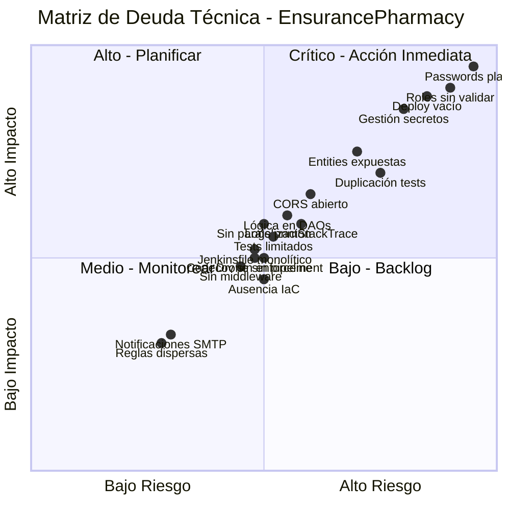

# 📊 Matriz de Deuda Técnica – EnsurancePharmacy

Este documento resume y prioriza la deuda técnica identificada en el repositorio, diferenciada entre el **Pipeline CI/CD** y la **Aplicación**. Cada matriz se acompaña de su leyenda, análisis y acciones recomendadas.

> **💡 Visualización interactiva**: Abre `matriz-deuda-tecnica-grafica.html` en tu navegador para ver la matriz gráfica con Canvas API.

## Diagrama de Cuadrantes (Riesgo vs Impacto)

### Distribución por Categoría

| Zona | Pipeline | Aplicación | Total |
|------|----------|------------|-------|
| 🟥 **Crítico** (Alta prioridad) | 2 | 3 | **5** |
| 🟧 **Alto** (Planificar) | 2 | 2 | **4** |
| 🟨 **Medio** (Monitorear) | 4 | 3 | **7** |
| 🟩 **Bajo** (Backlog) | 1 | 1 | **2** |

---

## 1. Pipeline (CI/CD)

> **Leyenda de colores**: 🟥 Alto impacto • 🟧 Medio impacto • 🟩 Bajo impacto

<table>
  <thead>
    <tr>
      <th>Área</th>
      <th>Deuda</th>
      <th>Impacto</th>
      <th>Riesgo</th>
      <th>Acciones recomendadas</th>
    </tr>
  </thead>
  <tbody>
    <tr>
      <td rowspan="3"><strong>Ejecution &amp; Performance</strong></td>
      <td>Jobs SonarQube repiten tests (duplicación de build)</td>
      <td>🟥</td>
      <td>Medio</td>
      <td>Reutilizar artefactos de cobertura generados en los jobs de pruebas (publicar como artifacts y consumirlos desde los jobs Sonar).</td>
    </tr>
    <tr>
      <td>Pipeline serial – poca paralelización</td>
      <td>🟧</td>
      <td>Medio</td>
      <td>Reestructurar dependencias para permitir ejecución paralela (p.ej. matrices o orquestación separada para backend/frontend).</td>
    </tr>
    <tr>
      <td>Deploy scripts no invocados por GitHub Actions</td>
      <td>🟥</td>
      <td>Alto</td>
      <td>Integrar `scripts/deploy.sh` (o playbooks equivalentes) en los jobs `deploy-*`; parametrizar por ambiente.</td>
    </tr>
    <tr>
      <td rowspan="2"><strong>Seguridad &amp; Gobernanza</strong></td>
      <td>Gestión de secretos no documentada (GitHub + Jenkins)</td>
      <td>🟥</td>
      <td>Alto</td>
      <td>Documentar rotación; considerar Secret Manager / Vault; habilitar escaneo automático de secretos.</td>
    </tr>
    <tr>
      <td>Referencia a Drone CI sin pipeline versionado</td>
      <td>🟧</td>
      <td>Medio</td>
      <td>Versionar `.drone.yml` o retirar dependencias para evitar drift operativo.</td>
    </tr>
    <tr>
      <td rowspan="2"><strong>Observabilidad &amp; Alertas</strong></td>
      <td>Codecov sin enforcement de cobertura mínima</td>
      <td>🟧</td>
      <td>Medio</td>
      <td>Configurar status check en Codecov/Sonar para bloquear merges con cobertura baja.</td>
    </tr>
    <tr>
      <td>Notificaciones limitadas a email SMTP</td>
      <td>🟩</td>
      <td>Bajo</td>
      <td>Añadir canal alterno (Slack/Teams) y healthcheck del servidor SMTP.</td>
    </tr>
    <tr>
      <td rowspan="2"><strong>Infraestructura</strong></td>
      <td>Ausencia de IaC para ambientes</td>
      <td>🟧</td>
      <td>Medio</td>
      <td>Versionar docker-compose/terraform/ansible utilizados en despliegues; integrar a pipeline.</td>
    </tr>
    <tr>
      <td>Jenkinsfile monolítico</td>
      <td>🟧</td>
      <td>Medio</td>
      <td>Extraer lógica repetida a librería compartida y parametrizar análisis por servicio.</td>
    </tr>
  </tbody>
</table>

### 1.1. Priorización sugerida

1. Automatizar despliegues (`deploy-*`) y asegurar reutilización de artefactos (impacto inmediato en confiabilidad y tiempo de feedback).
2. Establecer política de secretos centralizada y versionar la pipeline Drone (evitar configuraciones divergentes).
3. Optimizar performance (paralelización) y reforzar observabilidad (enforcement de cobertura y alertas multi-canal).

---

## 2. Aplicación (Backends + Frontends)

> **Leyenda de colores**: 🟥 Crítico • 🟧 Importante • 🟩 Menor

<table>
  <thead>
    <tr>
      <th>Capa</th>
      <th>Deuda</th>
      <th>Impacto</th>
      <th>Riesgo</th>
      <th>Acciones recomendadas</th>
    </tr>
  </thead>
  <tbody>
    <tr>
      <td rowspan="4"><strong>Seguridad</strong></td>
      <td>Passwords en texto plano (`UserDAO`)</td>
      <td>🟥</td>
      <td>Muy alto</td>
      <td>Implementar hashing (BCrypt/Argon2), migrar datos y ajustar flujo de login.</td>
    </tr>
    <tr>
      <td>Roles sin control server-side (role=" ")</td>
      <td>🟥</td>
      <td>Alto</td>
      <td>Definir enum de roles, validar en backend y devolver 403 cuando corresponda.</td>
    </tr>
    <tr>
      <td>CORS abierto a `*`</td>
      <td>🟧</td>
      <td>Medio</td>
      <td>Restringir orígenes/headers por ambiente y agregar protección CSRF.</td>
    </tr>
    <tr>
      <td>Exposición directa de entidades en JSON</td>
      <td>🟧</td>
      <td>Medio</td>
      <td>Introducir DTOs / MapStruct, ocultar campos sensibles (password, flags internos).</td>
    </tr>
    <tr>
      <td rowspan="3"><strong>Arquitectura</strong></td>
      <td>Lógica de negocio en DAOs/handlers</td>
      <td>🟧</td>
      <td>Medio</td>
      <td>Crear capa de servicios; dejar DAOs para acceso a datos únicamente.</td>
    </tr>
    <tr>
      <td>Uso directo de `HttpServer` sin middleware común</td>
      <td>🟧</td>
      <td>Medio</td>
      <td>Evaluar migración a framework (Spring) o crear routers/middlewares reutilizables.</td>
    </tr>
    <tr>
      <td>Reglas de expiración dispersas (`checkServiceExpiration`)</td>
      <td>🟩</td>
      <td>Bajo</td>
      <td>Centralizar reglas en servicios y documentar casos límite (timezones).</td>
    </tr>
    <tr>
      <td rowspan="3"><strong>Calidad &amp; Observabilidad</strong></td>
      <td>Logs con `printStackTrace`</td>
      <td>🟧</td>
      <td>Medio</td>
      <td>Integrar SLF4J/Logback con niveles y correlación (requestId).</td>
    </tr>
    <tr>
      <td>Tests limitados (unitarios positivos)</td>
      <td>🟧</td>
      <td>Medio</td>
      <td>Añadir tests negativos e integración (REST), mocks de DAO, e2e críticos.</td>
    </tr>
    <tr>
      <td>Fetch/estado duplicado en frontends</td>
      <td>🟩</td>
      <td>Bajo</td>
      <td>Extraer composables/services comunes y aplicar atomic design para componentes.</td>
    </tr>
  </tbody>
</table>

### 2.1. Roadmap de mitigación

1. **Hardening de seguridad**: hashing de contraseñas, roles server-side, DTOs y límites CORS.
2. **Refactor arquitectónico**: capa de servicios, logging estructurado, control de errores centralizado.
3. **Mejora de calidad**: ampliar cobertura de tests (negativa/integración) y reutilización en frontends.

---

## 3. Acciones inmediatas sugeridas

1. **Seguridad crítica**
   - Hashing de contraseñas + migración.
   - Roles y autorización en backend.
   - Revisión de exposición de datos sensibles en APIs.

2. **Pipeline confiable**
   - Automatizar despliegues por branch.
   - Reutilizar artefactos de coverage y documentar secretos.
   - Versionar pipeline Drone o retirar dependencias.

3. **Observabilidad y calidad**
   - Configurar enforcement de cobertura (Codecov/Sonar).
   - Introducir logging estructurado con niveles.
   - Expandir suite de tests e integrar escenarios negativos.

---

> **Nota**: Este archivo debe mantenerse junto a los ajustes de la plataforma para asegurar que la evolución del sistema incluya la gestión activa de la deuda técnica.
